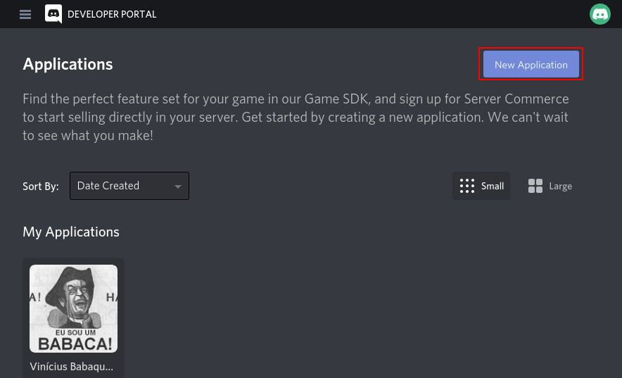
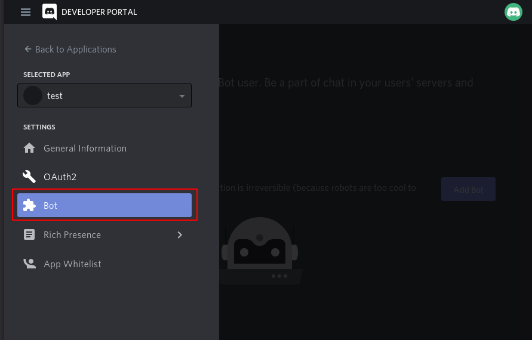
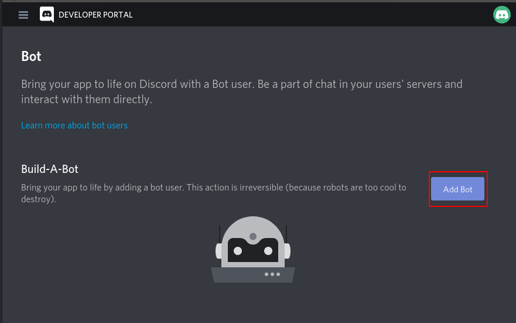
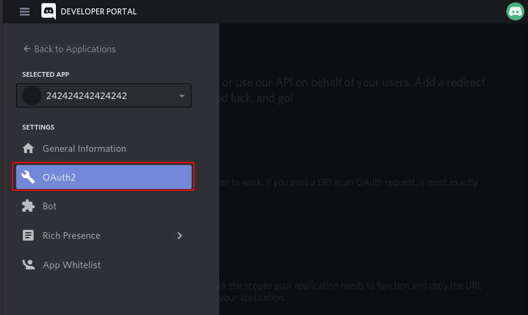
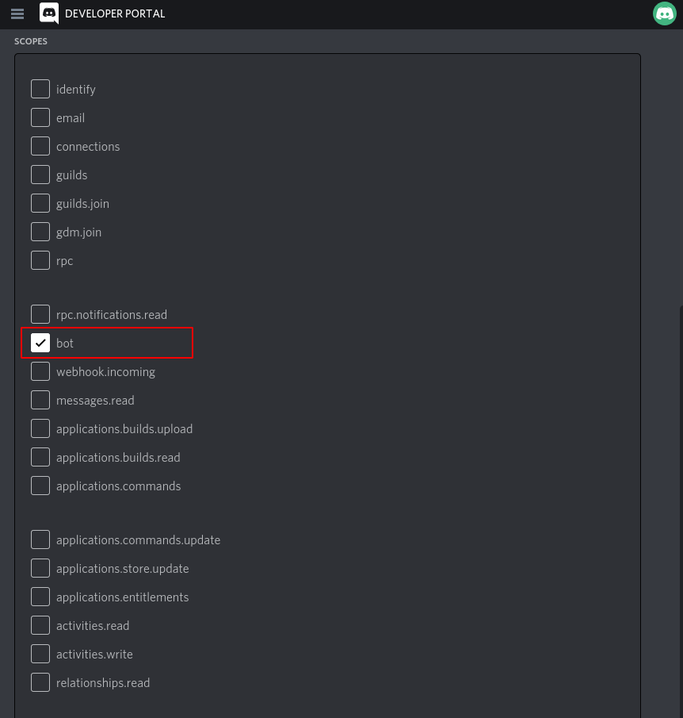
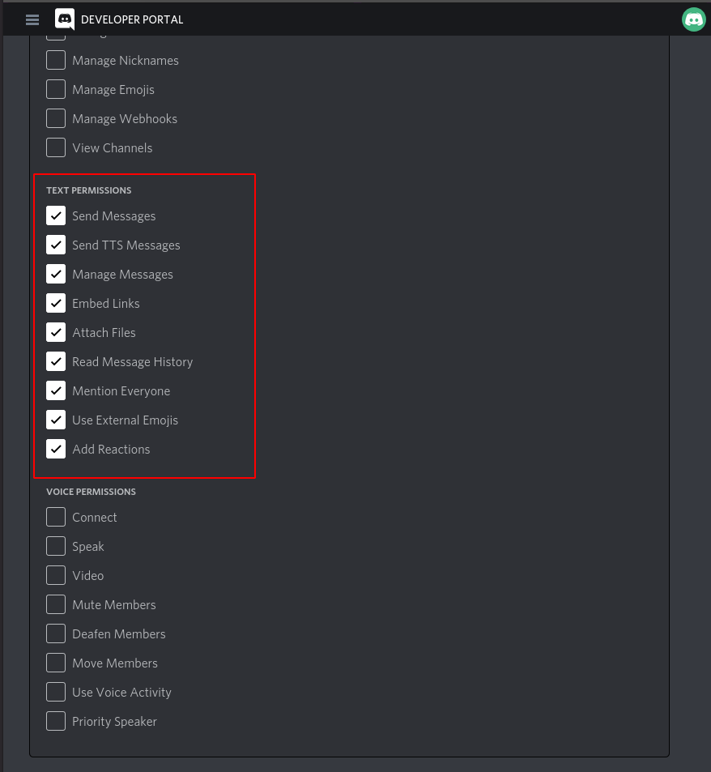
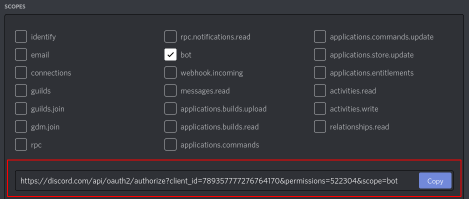
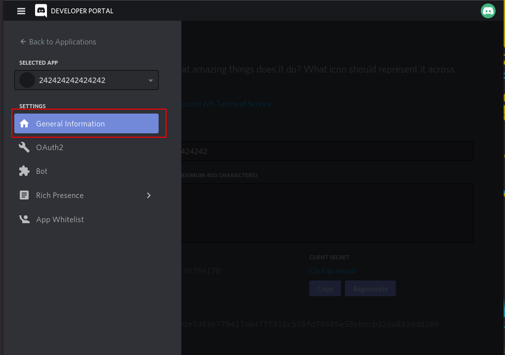
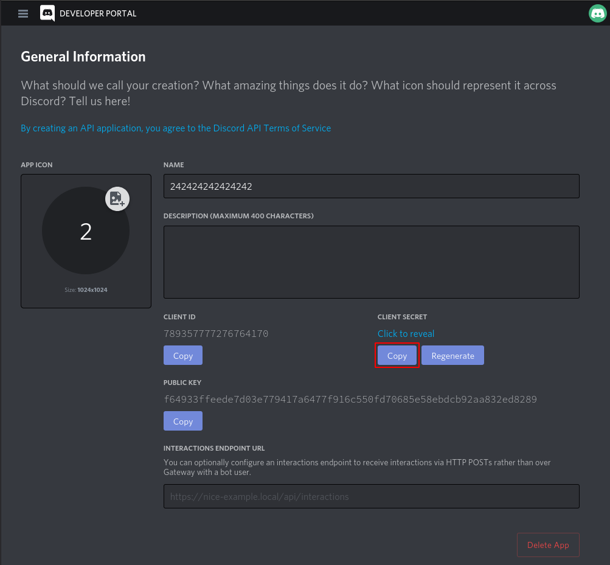

# **Annoying Discord Bot** (ADB)
## A super obnoxious discord bot.

### 1) **Setup**

Access your discord developer profile via this [link](https://discord.com/developers), and click in the "New Application" button:



In the side navibar, select "Bot" option and "Add Bot":




Now, in the "OAuth2" Option, select "bot" scope ante check all Text Permissions:






Finally, copy the resulting link in Scopes, and open up in your browser:



With that, your bot will be able to join any server that you own.

Now, back to the "General Information" section, you may copy your bot's token:




Create a .env file in the root folder and create a environment variable TOKEN, pasting the hash you just copied: 
```shell
TOKEN=w8aKr8YRFLnFFs3dWoS9Pt4hnZPvzPuR
```

### 2) **Build**
```shell
$ docker build -t bot-image .
```

### 3) **Run**
```shell
$ docker run --env-file=.env bot-image
```
---
## *TODO*:
- [ ] Implement geckodriver path in Dockerfile (firefox selenium webdriver)
- [ ] Implement Commands API in README
- [x] Implement --help command
- [ ] Implement RPG-like class, with a Finite State Machine

